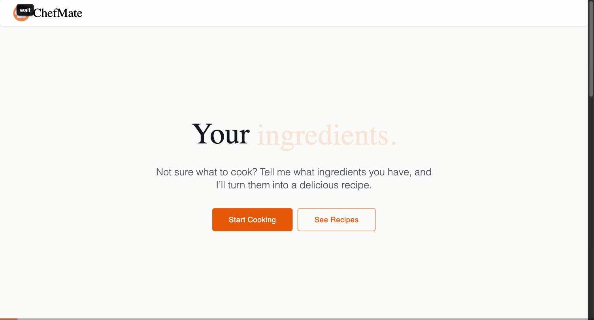

# ChefMate

ChefMate is an app I built for nights when I have random ingredients and no idea what to make. List what's in your kitchen, and this AI Chef will turn it into a recipe you can actually cook.

## Demo



## What It Does

- **Ingredient input** — add what you have (with quick-add suggestions for common staples), and set preferences.
- **AI recipe generation** — an LLM turns your ingredients + preferences into a complete recipe: name, description, ingredient list, step-by-step instructions, cuisine, cook time, and servings.
- **Personal cookbook** — save generated recipes, browse them as a grid of cards

## How It's Built

A two-part app: a React single-page app talks to an Express API, which in turn talks to OpenRouter (for recipe generation using AI) and Supabase (for the database and storage).

```
┌─────────────┐      HTTP       ┌─────────────┐
│  frontend/  │ ───────────────▶│  backend/   │
│  React SPA  │◀─────────────── │  Express API│
└─────────────┘                 └──────┬──────┘
                                        │
                        ┌───────────────┼────────────────┐
                        ▼               ▼                ▼
                  OpenRouter      Supabase Postgres  Supabase Storage
                (recipe text +      (saved recipes)    (photos)
                 dish images)
```

## Tech-Stack

**Frontend** — React 19, TypeScript, Vite, Tailwind CSS v4, React Router, react-markdown, react-hot-toast, lucide-react.

**Backend** — Node.js, Express 5, TypeScript, Drizzle ORM, OpenRouter SDK.

**AI models (via [OpenRouter](https://openrouter.ai))** — gemini-3.8-flash and gemini-3.1-flash-image.

**Data** — Postgres + Storage, both hosted on [Supabase](https://supabase.com).

## 🚀 Getting started

### Prerequisites:

- Node.js 22+ (see each subproject's README for the exact requirement)
- A [Supabase](https://supabase.com) project for storage
- An [OpenRouter](https://openrouter.ai) API key

### Project Structure:

```
what-can-i-cook/
├── frontend/   # React + Vite SPA — see frontend/README.md
└── backend/    # Express API — see backend/README.md
```

### How To Install/Start:

```bash
# Backend
cd backend
npm install
cp .env.example .env   # fill in the values — see backend/README.md
npm run dev             # http://localhost:3000

# Frontend
cd frontend
npm install
cp .env.example .env   # optional — defaults work for local dev
npm run dev             # http://localhost:5173
```

## License

[MIT](LICENSE)
