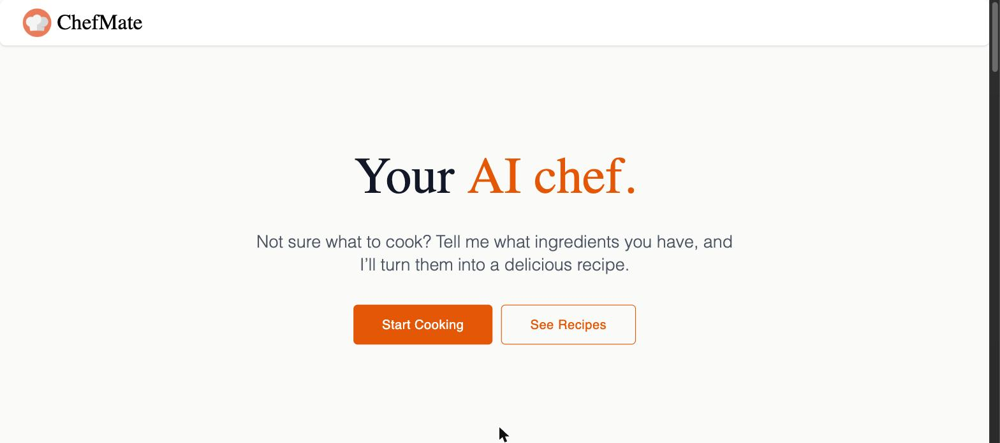
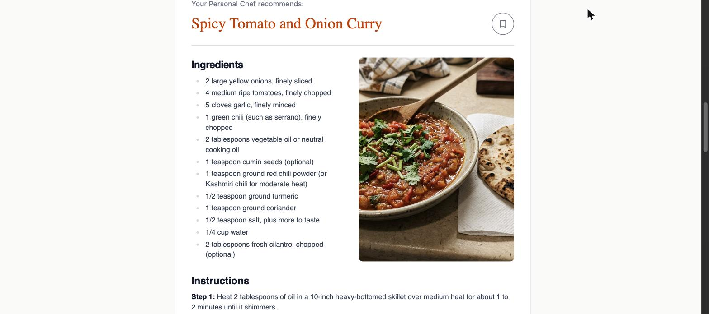
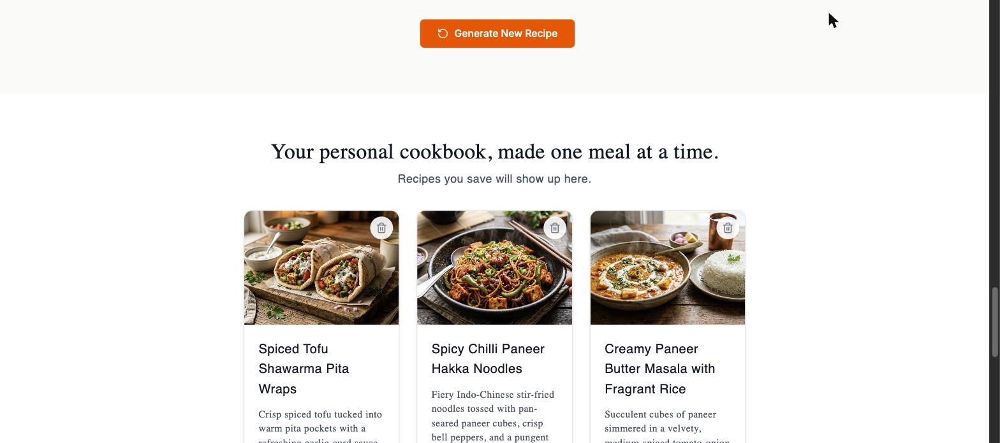

# ChefMate

Tell it what's in your kitchen, and it turns those ingredients into a full recipe — written out, plated, and photographed by AI — that you can save to a personal cookbook.

## Screenshots

| | |
|---|---|
|  |  |
|  | |

## What it does

- **Ingredient input** — add what you have (with quick-add suggestions for common staples), and set preferences (vegetarian, spice level).
- **AI recipe generation** — an LLM turns your ingredients + preferences into a complete recipe: name, description, ingredient list, step-by-step instructions, cuisine, cook time, and servings.
- **AI dish photography** — a second AI call generates a photo of the finished dish, styled to look like a home cook's own photo rather than a staged studio shot.
- **Personal cookbook** — save generated recipes, browse them as a grid of cards, open a full recipe page, or delete ones you don't want anymore.

## How it's built

A two-part app: a React single-page app talks to an Express API, which in turn talks to OpenRouter (for AI generation) and Supabase (for the database and image storage).

```
┌─────────────┐      HTTP       ┌─────────────┐
│  frontend/  │ ───────────────▶│  backend/   │
│  React SPA  │◀─────────────── │  Express API│
└─────────────┘                 └──────┬──────┘
                                        │
                        ┌───────────────┼────────────────┐
                        ▼               ▼                ▼
                  OpenRouter      Supabase Postgres  Supabase Storage
                (recipe text +      (saved recipes)    (dish photos)
                 dish images)
```

### Tech stack

**Frontend** — React 19, TypeScript, Vite, Tailwind CSS v4, React Router, react-markdown, react-hot-toast, lucide-react.

**Backend** — Node.js, Express 5, TypeScript, Drizzle ORM, `postgres`, `@supabase/supabase-js`, OpenRouter SDK.

**AI models (via [OpenRouter](https://openrouter.ai))** — Gemini for recipe text, Gemini's image model for dish photos.

**Data** — Postgres + Storage, both hosted on [Supabase](https://supabase.com).

## Project structure

```
what-can-i-cook/
├── frontend/   # React + Vite SPA — see frontend/README.md
└── backend/    # Express API — see backend/README.md
```

## Getting started

You'll need:
- Node.js 22+ (see each subproject's README for the exact requirement)
- A [Supabase](https://supabase.com) project (Postgres database + Storage)
- An [OpenRouter](https://openrouter.ai) API key

Then, in two terminals:

```bash
# Backend
cd backend
npm install
cp .env.example .env   # fill in the values — see backend/README.md
npm run dev             # http://localhost:3000

# Frontend
cd frontend
npm install
cp .env.example .env   # optional — defaults work for local dev
npm run dev             # http://localhost:5173
```

Full setup details (database schema, storage bucket, every environment variable) are in [`backend/README.md`](backend/README.md) and [`frontend/README.md`](frontend/README.md).

## License

[MIT](LICENSE)
